# Game Analytics Lakehouse

An end-to-end data engineering pipeline on **Databricks** that ingests raw game telemetry, cleans it, checks its quality, models it into a star schema, and serves analytics through a dashboard. It runs as a scheduled, orchestrated job and handles new data incrementally and idempotently.

**Stack:** PySpark, Delta Lake, Auto Loader, Databricks Workflows, SQL, Python

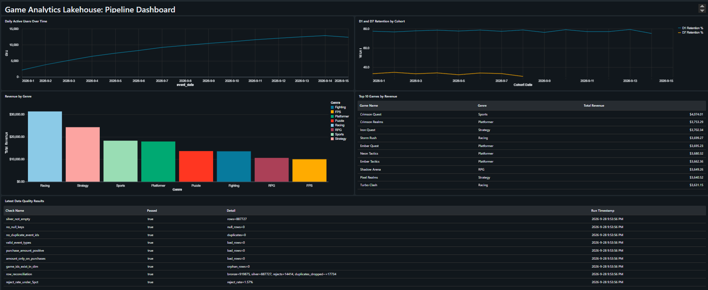

---

## Architecture

```
Raw JSON/CSV files (Unity Catalog Volume)
        |
        v   Auto Loader (incremental, availableNow)
   BRONZE   raw strings + audit columns, nothing dropped
        |
        v   clean, dedupe, MERGE on event_id
   SILVER   typed, validated, deduplicated events
        |         \
        |          `--> silver_rejects  (bad rows quarantined with a reason)
        v   quality gate (9 checks, fails the job on any failure)
    GOLD    star schema + analytics marts
        |
        v
  Dashboard (5 visuals)
```

Orchestrated by the Databricks Job `game-analytics-daily`: **bronze -> silver -> quality -> gold**, running daily at 06:00 IST with retries and failure email alerts.

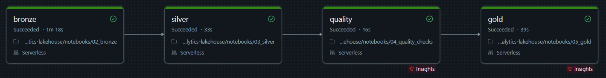

---

## The data

Databricks Free Edition restricts outbound internet, so the data is generated locally by `01_generate_data.py`: simulated telemetry for **60,000 players** and **40 games** over **Sept 1-15, 2026**. It is deliberately dirty, with duplicates, null keys, mixed timestamp formats, invalid event types, and bad purchase amounts, so the cleaning and quality logic has real work to do.

---

## Layers

### Bronze: ingest everything, change nothing
- Auto Loader (`cloudFiles`) with `trigger(availableNow=True)` reads only new files, so reruns never duplicate data.
- All fields are kept as raw strings, plus audit columns (source file, ingest time).
- Tables: `bronze_events`, `bronze_games`, `bronze_players`.

### Silver: clean, validate, deduplicate
- Parsing uses `try_to_timestamp` and `try_cast`, which return NULL instead of crashing. Serverless compute runs in ANSI mode, where a strict cast on dirty data would fail the whole job.
- Bad rows are **quarantined, not deleted**, into `silver_rejects` with a `reject_reason`.
- Duplicates are removed with `row_number()` over `event_id`.
- Writes use an idempotent `MERGE INTO ... WHEN NOT MATCHED` on `event_id`, so rerunning the pipeline never double-counts.

Reject breakdown from the initial load:

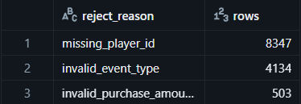

### Quality gate: fail fast before Gold
Nine automated checks are logged to `dq_results`, and the job **raises an exception if any check fails**, so bad data never reaches the marts:

`silver_not_empty`, `no_null_keys`, `no_duplicate_event_ids`, `valid_event_types`, `purchase_amount_positive`, `amount_only_on_purchases`, `game_ids_exist_in_dim`, `row_reconciliation`, `reject_rate_under_5pct`

The gate was tested by inserting a bad row on purpose: `no_null_keys` failed as expected and blocked the run.

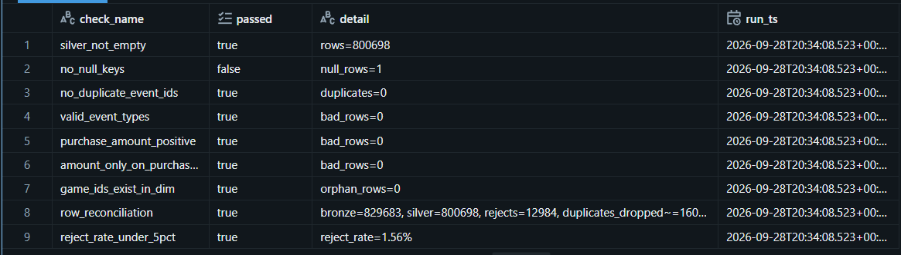
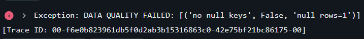

After removing the bad row, all checks pass again:

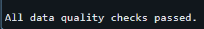

### Gold: analytics-ready
- Star schema: `fact_events`, `dim_game`, `dim_player`.
- Marts: `gold_daily_active_users`, `gold_retention` (D1 / D7), `gold_daily_revenue_by_game`, `gold_top_games_by_genre`.
- Rebuilt with `CREATE OR REPLACE TABLE ... AS SELECT`, so late-arriving data is always reflected.
- D7 retention is correctly `NULL` for cohorts whose 7-day window is not complete yet.

Daily active users (initial load):

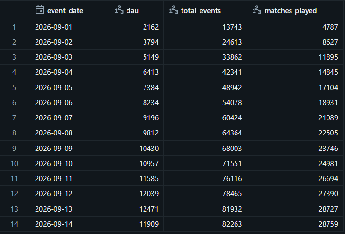

D1 / D7 retention by cohort:

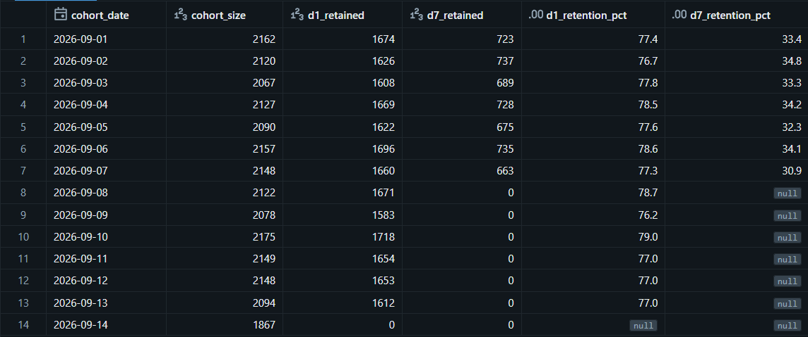

Top games per genre:

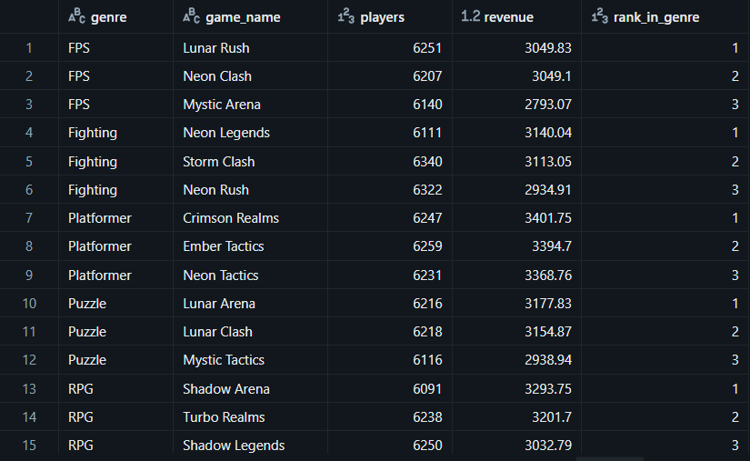

---

## Results

| Metric | Value |
|---|---|
| Raw events ingested (Bronze) | **919,875** |
| Clean events (Silver) | **887,727** |
| Rejected events (quarantined) | **14,414** (1.57% reject rate) |
| Duplicates dropped | ~17,734 |
| Reconciliation | Bronze = Silver + Rejects + Duplicates |
| Quality checks passing | **9 / 9** |
| Daily active users | Grew from 2,162 (Sept 1) to roughly 12,500 by mid-period |
| D1 retention | ~75-79% |
| D7 retention | ~30-35% |

Initial-load reject reasons: `missing_player_id` (8,347), `invalid_event_type` (4,134), `invalid_purchase_amount` (503).

Quality gate results and row reconciliation from the initial load:

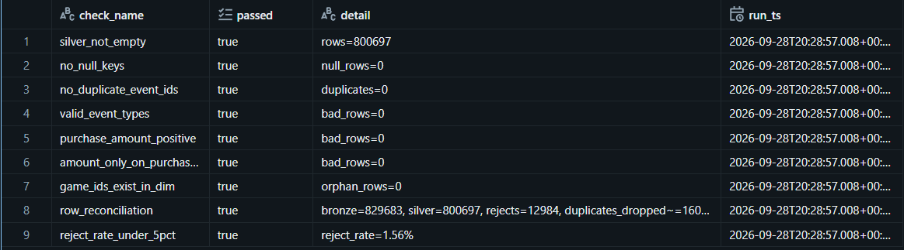
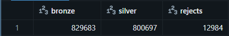

---

## Incremental load demo

To prove the pipeline is incremental and idempotent end to end, I loaded a new day (**2026-09-15, 90,192 events**) and ran the full orchestrated job:

| Table | Before | After |
|---|---|---|
| `bronze_events` | 829,683 | 919,875 (+90,192) |
| `silver_events` | 800,697 | 887,727 (+87,030) |
| `gold_daily_active_users` | no Sept 15 row | Sept 15 row added |

Only the new file was processed, and existing rows were not duplicated.

Before the incremental run:

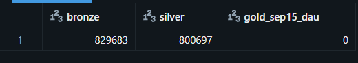

After the incremental run:

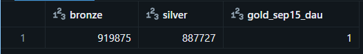

---

## Repo structure

```
notebooks/
  00_config.py          shared config (catalog, schema, paths)
  01_generate_data.py   dirty telemetry generator
  02_bronze.py          Auto Loader ingestion
  03_silver.py          cleaning, quarantine, dedup, MERGE
  04_quality_checks.py  9-check quality gate
  05_gold.py            star schema and marts
  06_run_all.py         local run-all helper
docs/                   screenshots
```

## How to run

1. Import this repo into Databricks as a Git folder.
2. Run `01_generate_data.py` to create the raw files in `/Volumes/workspace/game_analytics/raw`.
3. **Run the pipeline as a Job (primary path).** Create a Databricks Job with four chained tasks on serverless compute: `02_bronze` -> `03_silver` -> `04_quality_checks` -> `05_gold`, each depending on the one before. Click **Run now**, or add a schedule (this project runs daily at 06:00 IST). A failed quality check stops the run before Gold is built.
4. **Simulate a new day.** Use the notebook widget UI to regenerate data for a single date, then run the Job again. Only the new files are ingested, and existing rows are not duplicated.

**Fallback:** to debug a single layer, run notebooks `02` to `05` manually in order.

## Design decisions

- **Medallion architecture:** raw data stays replayable in Bronze, while Silver and Gold can be rebuilt without re-ingesting.
- **Idempotency:** `MERGE` on the event key means retries and reruns are safe.
- **Quarantine instead of delete:** rejected rows stay auditable, and reject rates can be monitored.
- **Fail-fast quality gate:** bad data is stopped between Silver and Gold, not discovered in a dashboard.
- **Scaling path:** the same design extends to streaming sources such as Kafka by swapping the Auto Loader source for a streaming read.